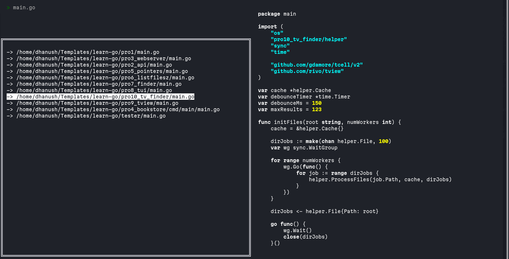
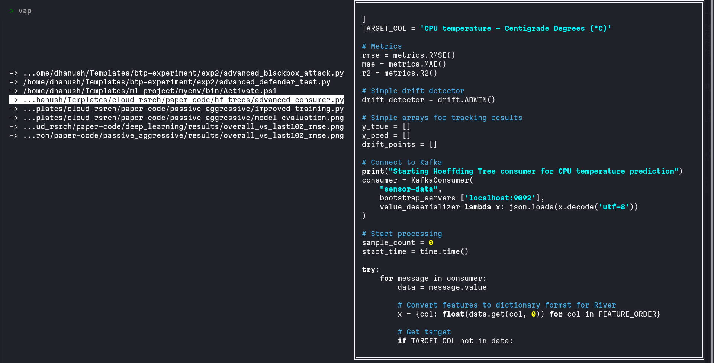

# go-file-finder

A fast terminal-based file finder with real-time fuzzy search, built with Go.

## Features

- Fast concurrent file indexing using worker pools
- Fuzzy search with intelligent ranking
- Real-time indexing progress
- File preview with syntax highlighting
- Keyboard-driven navigation
- Debounced search for smooth performance

## Installation

```bash
git clone https://github.com/ErascusPlatypus/go-file-finder-v2.git
cd go-file-finder
go mod download
go build -o pro10_tv_finder
./pro10_tv_finder
```

## Usage

```bash
# Search current directory
./pro10_tv_finder

## Screenshots



##  Examples



## Keybindings

| Key | Action |
|-----|--------|
| Type | Search files |
| Down Arrow | Move to results |
| Up Arrow | Return to search |
| Right Arrow | Open preview |
| Left Arrow | Close preview |
| Enter | Preview file |
| Ctrl+C | Quit |

## How It Works

### Concurrent Indexing

Uses a worker pool of 10 goroutines to scan directories in parallel. Each worker processes directories from a shared queue, adding subdirectories back to the queue for other workers to process.

### Search Ranking

Results are scored based on match quality:

- Exact filename match: highest priority
- Prefix match in filename: high priority
- Match at word boundaries: medium priority
- Consecutive character matches: bonus points
- Matches in filename vs directory path: filename preferred

### Performance

On a typical codebase with 10,000 files:

- Indexing: 2,000-5,000 files/second
- Search latency: under 1ms
- 3-5x faster than sequential indexing

## Configuration

Key settings in the code:

```go
numWorkers   = 10   // Concurrent workers for indexing
maxResults   = 100  // Maximum search results shown
debounceMs   = 150  // Search delay in milliseconds
```

### Ignored Directories

Configure which directories to skip:

```go
var ignoredDirs = map[string]struct{}{
    ".git":         {},
    "node_modules": {},
    ".next":        {},
    "target":       {},
    ....
}
```

## Architecture

```
go-file-finder/
├── main.go              # Entry point and UI
├── helper/
│   ├── cache.go         # File cache
│   ├── search.go        # Search and scoring
│   ├── indexer.go       # Concurrent indexing
│   └── highlight.go     # Syntax highlighting
└── README.md
```

### Core Components

**Cache**: Thread-safe file storage using sync.RWMutex

**Worker Pool**: Parallel directory scanning with channels

**Debounced Search**: 150ms delay prevents excessive searches while typing

**Smart Scoring**: Ranks results by relevance using multiple heuristics

## Contributing

Contributions welcome. Potential improvements:

- Regex search support
- File content search
- Persistent index caching
- File system watcher for live updates

## License

MIT License

## Dependencies

- github.com/rivo/tview - Terminal UI
- github.com/gdamore/tcell/v2 - Terminal handling